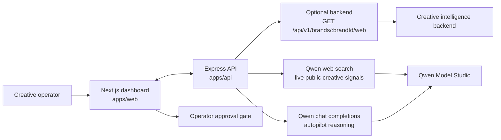

# Signal Architecture

Signal separates product experience, API control, and model-backed analysis so the dashboard can stay opinionated without embedding provider-specific logic in the UI. The frontend reads from a thin Express API. The API fetches live ad-graph data from a configured creative intelligence backend when available, or from Qwen Model Studio web search when no separate backend is configured, then calls Qwen for reasoning output.

## End-to-End Diagram

## Product Layers

- `apps/web` renders the Creative Radar experience, family weak spots, pattern map, and the operator approval gate.
- `apps/api` owns request IDs, validation, error mapping, timeouts, the typed proxy to the live creative backend, and direct Qwen Model Studio calls.
- `apps/mcp` exposes Signal's creative endpoints as MCP tools for Model Studio attachment.
- The upstream creative backend is the system of record for live ad-graph retrieval when configured. If it is not configured, Qwen web search collects current public creative signals directly. Qwen brief generation is handled by this API when `DASHSCOPE_API_KEY` is configured.

## Request Flow

### Overview

1. The web app requests `GET /api/creative/overview`.
2. The API fetches live creative nodes and stats from the upstream backend, or asks Qwen web search for current public owned and competitor creative signals.
3. The service normalizes records into owned ads, competitor ads, families, patterns, and meta signals.
4. The UI renders fatigue, saturation, and white-space signals directly from those live responses.

### Radar Prompt

1. The operator submits a natural-language prompt in the Creative Radar panel.
2. The API first rebuilds the latest overview so the prompt is grounded in current portfolio context.
3. The API sends the prompt, portfolio summary, and meta signals to Qwen Model Studio's OpenAI-compatible chat-completions endpoint.
4. Qwen returns a structured brief with metrics, alerts, and strategy.
5. The UI presents the result behind an explicit human approval checkpoint before handoff.

### Autopilot Agent Run

1. The operator runs the `Autopilot Agent` from the same panel.
2. The API fetches live overview data and identifies the weakest owned family, strongest competitor signal, and open pattern territory.
3. The API composes an agent goal and grounded mission prompt, then calls Qwen Model Studio directly.
4. The API returns a structured agent packet with:
   - the goal
   - a recommended action type
   - grounding evidence
   - the Qwen brief
   - human checkpoints
5. The operator approves or rejects that packet before any downstream handoff.

## Human-in-the-Loop Design

Signal is intentionally not a one-click autonomous publisher. The operator must review the brief for:

- brand fit
- channel and format fit
- enough novelty to avoid repeated fatigue

That keeps the product aligned with Track 4's requirement for human checkpoints at critical decision points while still automating the evidence gathering and first-pass reasoning.

## Reliability and Safety

- The API returns `503 CreativeNotConfigured` when upstream credentials are missing instead of serving fake production data.
- Upstream responses are validated with Zod before the UI sees them.
- Qwen responses are parsed as strict JSON and validated with Zod before they are returned to the UI or MCP tools.
- `CREATIVE_INTEL_TIMEOUT_MS` bounds slow upstream calls.
- `apps/api/policy.yaml` restricts egress to local development endpoints and approved Alibaba Cloud hosts.
- Every request receives an `x-request-id` for debugging and demo traceability.

## Deployment Story

The repo packages the backend for Alibaba Cloud Function Compute first, with containers as an optional advanced path:

- `deploy/alibaba-cloud/function-compute/build-package.sh` builds a zip package for Function Compute.
- `deploy/alibaba-cloud/function-compute/bootstrap` starts the Express API on the Function Compute web runtime port.
- `apps/api/Dockerfile` remains available for an optional production image.
- `deploy/alibaba-cloud/acs/signal-api.yaml` remains available for an optional stateless workload with health checks and a public LoadBalancer service.
- `deploy/alibaba-cloud/acs/signal-api-secret.example.yaml` defines the runtime secrets needed for the live upstream backend.

The intended low-cost hackathon proof path is Function Compute for the running API plus Qwen Model Studio for model calls. ACR, ACK, and Terraform are optional and should not be treated as required.

## Managed Agent Story

For the direct Qwen Cloud agent submission path, Signal now defines:

- a Managed Agent spec in `deploy/alibaba-cloud/model-studio`
- a cloud environment spec for Agent Studio sessions
- a custom MCP service in `apps/mcp`

The remaining account-side step is to deploy that MCP service remotely and register it in Model Studio so the Managed Agent can call the Signal tools directly.

## Important Routes

- `GET /health`
- `GET /api/creative/overview`
- `POST /api/creative/radar`
- `POST /api/creative/autopilot`

## Testing

- API tests stub the live backend and cover health, overview, and radar routes.
- The UI contract is intentionally simple so the frontend can stay coupled to the typed API response rather than a mock data shape.
