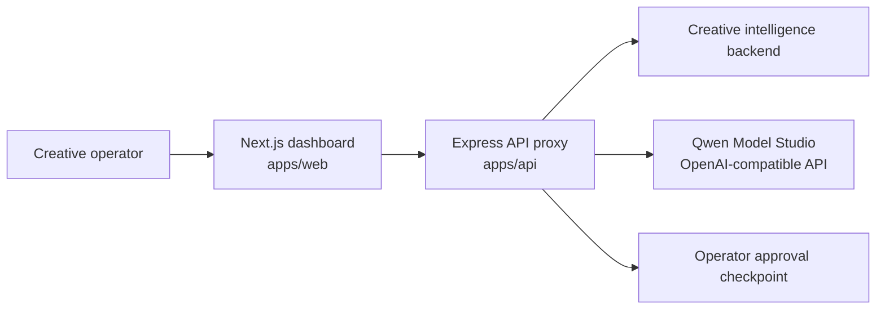

# Signal

Signal is a creative intelligence dashboard for marketing teams that need faster decisions on what creative to refresh, retire, or scale next. It ingests live owned and competitor ad nodes from either a configured creative intelligence backend or Qwen Model Studio web search, scores fatigue and pattern saturation, and turns that evidence into an operator-reviewed Qwen brief through Alibaba Cloud Model Studio.

The product is built for the Global AI Hackathon Series with Qwen Cloud, Track 4: Autopilot Agent. The automation is intentional: live signals are collected and summarized automatically, while a human approval gate stays in front of production handoff.

## What Signal Does

- Scores owned creative inventory for health, fatigue, and family-level weakness.
- Compares owned creative against competitor creative patterns and winning hooks.
- Builds grounded Qwen prompts from live portfolio signals instead of demo fixtures.
- Calls Qwen through Alibaba Cloud Model Studio's OpenAI-compatible API when `DASHSCOPE_API_KEY` is configured.
- Uses Qwen web search for live public creative signals when no separate creative backend is configured.
- Generates a structured brief with narrative, metrics, alerts, and next-step strategy.
- Runs an explicit `Autopilot Agent` flow that returns a recommended action, evidence, and checkpoints.
- Forces a human checkpoint before the brief is handed off to a creative team.
- Includes an optional MCP service that can expose Signal creative tools to Alibaba Cloud Managed Agents.

## Why It Fits Track 4

- It automates a real business workflow: creative diagnosis and refresh planning.
- It handles ambiguous natural-language prompts through the radar panel.
- It invokes an external live backend rather than relying on static local data.
- It exposes a distinct agent run surface through `POST /api/creative/autopilot`.
- It includes a human-in-the-loop approval gate before downstream action.
- It is prepared for Alibaba Cloud deployment, with a low-cost Function Compute path and an optional container path.
- It includes an optional MCP server for Model Studio tool attachment.

## System Diagram



More detail lives in [ARCHITECTURE.md](./ARCHITECTURE.md).

## Alibaba Cloud and Qwen Proof Path

If you need one repo path for Devpost review, start with [deploy/alibaba-cloud/acs/signal-api.yaml](./deploy/alibaba-cloud/acs/signal-api.yaml).

Supporting proof files:

- [deploy/alibaba-cloud/function-compute/standalone-agent.py](./deploy/alibaba-cloud/function-compute/standalone-agent.py) is the deployed single-file Function Compute web runtime for the live Qwen agent.
- [apps/api/src/services/creative-intelligence.service.ts](./apps/api/src/services/creative-intelligence.service.ts) validates live creative data and calls Qwen Model Studio directly for radar and autopilot runs.
- [apps/mcp/src/server.ts](./apps/mcp/src/server.ts) exposes `creative_overview`, `creative_radar`, and `creative_autopilot` as MCP tools.
- [apps/api/policy.yaml](./apps/api/policy.yaml) restricts public egress to approved local endpoints and Alibaba Cloud hosts.
- [apps/api/Dockerfile](./apps/api/Dockerfile) packages the backend for container deployment.
- [deploy/alibaba-cloud/terraform/main.tf](./deploy/alibaba-cloud/terraform/main.tf) documents a fuller Alibaba Cloud infrastructure path, but it is not required for the minimum Devpost submission.
- [docs/ALIBABA_CLOUD_DEPLOYMENT.md](./docs/ALIBABA_CLOUD_DEPLOYMENT.md) documents Alibaba deployment proof options.
- [deploy/alibaba-cloud/acs/deploy.sh](./deploy/alibaba-cloud/acs/deploy.sh) supports the container path when that is affordable.

## Repo Layout

- `apps/api` - Express API, live upstream proxy, route validation, deployment assets
- `apps/mcp` - custom MCP service for Signal creative tools
- `apps/web` - Next.js dashboard and operator review experience
- `deploy/alibaba-cloud` - Function Compute, container, and optional Terraform templates for Alibaba Cloud
- `deploy/alibaba-cloud/terraform` - optional Terraform stack for Alibaba network, ACK, and ACR provisioning
- `docs` - Devpost draft copy, proof requirements, and demo materials

## Local Run

```bash
npm install
cp .env.example .env
npm test
npm run dev:api
npm run dev:web
```

For local-only runs, keep `HOST=127.0.0.1`. For container or cloud deployment, set `HOST=0.0.0.0`.

## Runtime Configuration

```bash
HOST=127.0.0.1
PORT=4000
API_BASE_URL=http://127.0.0.1:4000
CREATIVE_INTEL_API_BASE_URL=https://...
CREATIVE_INTEL_BRAND_ID=...
CREATIVE_INTEL_BRAND_NAME=...
CREATIVE_INTEL_CATEGORY=...
CREATIVE_INTEL_TIMEOUT_MS=30000
DASHSCOPE_API_KEY=...
WORKSPACE_ID=...
QWEN_MODEL=qwen-plus
SIGNAL_TARGET_BRAND_NAME=Celsius
SIGNAL_TARGET_CATEGORY=energy drinks
```

Notes:

- `CREATIVE_INTEL_API_BASE_URL` points at the optional live creative intelligence backend.
- `CREATIVE_INTEL_BRAND_ID` identifies the optional brand workspace to analyze.
- `DASHSCOPE_API_KEY` enables direct Qwen Model Studio calls for `/radar` and `/autopilot`.
- `WORKSPACE_ID` lets the API use the Singapore workspace endpoint `https://{WORKSPACE_ID}.ap-southeast-1.maas.aliyuncs.com/compatible-mode/v1`.
- `SIGNAL_TARGET_BRAND_NAME` and `SIGNAL_TARGET_CATEGORY` are used by Qwen web search when no separate creative backend is configured.
- The API exposes `GET /api/creative/overview`, `POST /api/creative/radar`, and `POST /api/creative/autopilot`.
- When upstream or Qwen credentials are missing, the API returns an error instead of fake production content.
- In `NODE_ENV=production`, `CREATIVE_INTEL_API_BASE_URL` must not be `localhost`, `127.0.0.1`, or another local-only hostname.

## Current Readiness Status

The local implementation is complete and the low-cost Alibaba Cloud Function Compute agent is live. The hackathon submission is still not complete until public Devpost proof links and the demo video are filled.

- Local code and docs: implemented
- Alibaba Cloud Function Compute agent: live verified on `2026-07-15`
- Cloud endpoint: `https://signal-en-agent-ersgaojhti.ap-southeast-1.fcapp.run`
- Hosted UI: `https://signal-en-agent-ersgaojhti.ap-southeast-1.fcapp.run/`
- Proof record: [docs/proof/function-compute-live-proof.md](./docs/proof/function-compute-live-proof.md)
- Model Studio Managed Agent creation: optional, not required for the Devpost minimum
- Remote MCP registration: optional, not required for the Devpost minimum
- End-to-end cloud agent session: optional, not required for the Devpost minimum
- Demo video: not recorded in this repo yet

The strict readiness definition is documented in [docs/HACKATHON_READINESS_STANDARD.md](./docs/HACKATHON_READINESS_STANDARD.md).

## Submission Workbench

- [docs/DEVPOST_SUBMISSION.md](./docs/DEVPOST_SUBMISSION.md) - draft project description and judging map
- [docs/DEMO_SCRIPT.md](./docs/DEMO_SCRIPT.md) - three-minute demo outline
- [docs/ALIBABA_CLOUD_DEPLOYMENT.md](./docs/ALIBABA_CLOUD_DEPLOYMENT.md) - deployment and proof checklist
- [docs/MODEL_STUDIO_MANAGED_AGENT.md](./docs/MODEL_STUDIO_MANAGED_AGENT.md) - optional Managed Agent and MCP integration path
- [docs/HACKATHON_READINESS_STANDARD.md](./docs/HACKATHON_READINESS_STANDARD.md) - strict definition of when the project can be called ready
- [docs/HACKATHON_PROOF.md](./docs/HACKATHON_PROOF.md) - final evidence file that must be filled before submission
- [HACKATHON_COMPLETION_CHECKLIST.md](./HACKATHON_COMPLETION_CHECKLIST.md) - remaining work before final submission

## Implementation Check

```bash
npm run implementation:check
```

This validates the local implementation by running typecheck, tests, production builds, and an implementation artifact audit.

## Final Submission Check

```bash
npm run submission:check
```

This must fail until [docs/HACKATHON_PROOF.md](./docs/HACKATHON_PROOF.md) has the required Devpost proof: public repo, visible license, Alibaba Cloud deployment code proof, Alibaba Cloud screenshot proof, architecture URL, demo video URL, Track 4, final description status, and required Devpost answers.

The submission gate rejects local-only or unverifiable required proof, including:

- `localhost` or private-network proof URLs
- placeholder required values in the proof file
