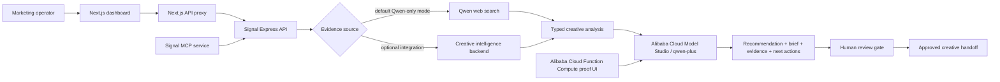

# Signal

**A Qwen-powered creative intelligence autopilot that turns current public market signals into an operator-reviewed creative action plan.**

[Live Alibaba Cloud demo](https://signal-en-agent-ersgaojhti.ap-southeast-1.fcapp.run/) | [Architecture](./ARCHITECTURE.md) | [Cloud proof](./docs/proof/function-compute-live-proof.md) | [Devpost copy](./docs/DEVPOST_SUBMISSION.md)

Signal is built for the **Global AI Hackathon Series with Qwen Cloud**, **Track 4: Autopilot Agent**. It automates the evidence-gathering and first-pass decision work behind creative refresh planning while keeping a human operator at the final approval boundary.

## Submission Status

Status last verified on **July 16, 2026**.

| Requirement | Status | Evidence |
| --- | --- | --- |
| Working project | Complete | Local and deployed Qwen flows return structured agent packets |
| Public open-source repository | Complete | [GitHub repository](https://github.com/shahaman098/Signal) and [MIT license](./LICENSE) |
| Qwen Cloud API usage | Complete | Direct Model Studio calls in [creative-intelligence.service.ts](./apps/api/src/services/creative-intelligence.service.ts) |
| Alibaba Cloud deployment | Live | [Function Compute endpoint](https://signal-en-agent-ersgaojhti.ap-southeast-1.fcapp.run/) and [deployment code](./deploy/alibaba-cloud/function-compute/standalone-agent.py) |
| Architecture diagram | Complete | [ARCHITECTURE.md](./ARCHITECTURE.md) |
| Text description | Complete | [Devpost submission draft](./docs/DEVPOST_SUBMISSION.md) |
| Demo recording | Generated locally | `output/demo/signal-qwen-demo.mp4`; public video URL still required |
| Devpost profile and eligibility answers | Pending owner | See [hackathon proof](./docs/HACKATHON_PROOF.md) |

**Honest verdict:** the software and cloud proof work. The Devpost submission is **not ready to submit** until the demo is uploaded publicly and the owner-only eligibility fields are completed. `npm run submission:check` is the final gate.

The official deadline is **July 20, 2026 at 2:00 PM PDT**, which is **10:00 PM BST**. Review the [official Devpost requirements](https://qwencloud-hackathon.devpost.com/) and [official rules](https://qwencloud-hackathon.devpost.com/rules) before submitting.

## The Problem

Growth teams repeatedly have to answer the same difficult questions:

- Which creative family is losing momentum?
- Which competitor pattern is gaining attention?
- What should be refreshed, retired, scaled, or tested next?
- Which recommendations are safe enough to hand to production?

That work is slow when evidence is scattered across ad libraries, public campaign pages, and internal creative systems. A generic chatbot does not solve the problem because it lacks a workflow, structured evidence, and an approval boundary.

Signal turns that process into an agent run.

## What Signal Does

1. Collects current owned and competitor creative observations from Qwen web search or an optional live creative-intelligence backend.
2. Normalizes the results into typed creative nodes and groups them into creative families.
3. Calculates family health, pattern saturation, weak spots, competitor momentum, and open creative territory.
4. Builds a grounded mission for Qwen from the latest portfolio state and the operator's natural-language prompt.
5. Produces a structured recommendation, strategy brief, evidence packet, alerts, and next actions.
6. Returns the run as `pending_human_review` until an operator confirms brand fit, platform fit, and novelty.

The result is not merely a chat response. It is a repeatable decision packet that can be reviewed, approved, and handed to a creative team.

## Core Features

| Feature | What it provides |
| --- | --- |
| Creative overview | Owned and competitor creative nodes, portfolio statistics, family health, and pattern status |
| Creative Radar | Qwen-generated analysis for ambiguous questions about fatigue, competitors, and white-space |
| Autopilot Agent | A deterministic action type plus Qwen brief, evidence, checkpoints, and next actions |
| Human review gate | Explicit approval requirements before production handoff |
| Qwen web search | Current public creative and competitor observations when no separate backend is configured |
| Typed validation | Zod validation for upstream data, Qwen completions, and API inputs |
| Fail-closed runtime | Missing credentials or non-live upstream output returns an error instead of local demo data |
| MCP tools | `creative_overview`, `creative_radar`, and `creative_autopilot` over stdio or remote HTTP/SSE |
| Alibaba Cloud runtime | A live low-cost Function Compute agent plus optional container and Terraform paths |
| Automated proof checks | Separate implementation, live-cloud, and submission-readiness commands |

## Why Track 4

The official Track 4 brief asks for a production-oriented agent that automates a real business workflow, handles ambiguous input, invokes external tools, and includes human checkpoints.

| Track 4 requirement | Signal implementation |
| --- | --- |
| Real business workflow | Creative diagnosis and refresh planning for growth and marketing teams |
| End-to-end automation | Evidence collection, normalization, analysis, recommendation, and brief generation |
| Ambiguous inputs | Operators can ask open-ended creative questions in the Radar panel |
| External tools and services | Qwen Cloud API, Qwen web search, optional creative backend, and optional MCP service |
| Human in the loop | Every autopilot result remains `pending_human_review` before handoff |
| Production readiness | Timeouts, schema validation, structured errors, request IDs, security headers, and no production mock fallback |

## Architecture



The repository supports two related runtime shapes:

- **Full application:** Next.js dashboard, Express API, and optional MCP service.
- **Live hackathon proof:** a compact Function Compute web runtime that calls Alibaba Cloud Model Studio directly and exposes the hosted proof UI and agent endpoints.

See [ARCHITECTURE.md](./ARCHITECTURE.md) for trust boundaries, request flow, and deployment details.

## Live Cloud Proof

The public Function Compute deployment is available without authentication for judging:

- Hosted proof UI: [signal-en-agent-ersgaojhti.ap-southeast-1.fcapp.run](https://signal-en-agent-ersgaojhti.ap-southeast-1.fcapp.run/)
- Health endpoint: [health](https://signal-en-agent-ersgaojhti.ap-southeast-1.fcapp.run/health)
- Region: `ap-southeast-1`
- Provider: Alibaba Cloud Model Studio
- Model: `qwen-plus`
- Runtime: Alibaba Cloud Function Compute

### Judge Quick Test

1. Open the [hosted proof UI](https://signal-en-agent-ersgaojhti.ap-southeast-1.fcapp.run/).
2. Click **Run Qwen Autopilot** and wait for the live web-search and model request to finish.
3. Confirm the response reports `mode=live`, `provider=Alibaba Cloud Model Studio`, `model=qwen-plus`, and `status=pending_human_review`.
4. Inspect the returned evidence, human checkpoints, and next actions.

No login is required for this controlled judging endpoint. A live run can take roughly 30 to 90 seconds because it includes web search and model generation.

Verify it from the repository:

```bash
npm run live:check
```

Or call the deployed agent directly:

```bash
curl --max-time 120 \
  -X POST https://signal-en-agent-ersgaojhti.ap-southeast-1.fcapp.run/api/creative/autopilot \
  -H 'Content-Type: application/json' \
  --data '{"prompt":"What creative territory should Celsius test next, and what requires human approval?"}'
```

Expected proof fields include:

```json
{
  "mode": "live",
  "status": "pending_human_review",
  "provider": "Alibaba Cloud Model Studio",
  "model": "qwen-plus"
}
```

Additional evidence is recorded in [function-compute-live-proof.md](./docs/proof/function-compute-live-proof.md) and [function-compute-console.jpg](./docs/proof/function-compute-console.jpg).

## Reality and Data Integrity

Signal deliberately fails closed:

- Production routes do not serve seeded, fixture, mock, or fabricated fallback packets.
- Missing live configuration returns `503 CreativeNotConfigured`.
- An optional upstream response marked `fallback` is rejected.
- Localhost upstreams are rejected in production.
- Qwen and upstream JSON are schema-validated before reaching the UI.
- Test files use mocked network responses for deterministic tests; those mocks are not available through production routes.

There is also an important data limitation: in Qwen-only mode, creative observations come from model-assisted public web search, and health scores are model-derived estimates. They are not authenticated Meta Ads or TikTok Ads account metrics. For account-level measurement, connect a licensed live backend through `CREATIVE_INTEL_API_BASE_URL` and `CREATIVE_INTEL_BRAND_ID`.

All generated recommendations remain subject to human review. Signal does not autonomously publish ads, move budget, or modify a production campaign.

## Technology

- **Frontend:** Next.js 16, React 18, TypeScript
- **API:** Express, Zod, Helmet, CORS
- **AI:** Alibaba Cloud Model Studio, `qwen-plus`, OpenAI-compatible chat completions, Qwen web search
- **Agent tools:** Model Context Protocol SDK with stdio, Streamable HTTP, and SSE transports
- **Cloud:** Alibaba Cloud Function Compute; optional ACS container and Terraform assets
- **Quality:** Vitest, Supertest, TypeScript project references, Playwright, npm audit

## Repository Layout

```text
apps/
  api/                         Express API and creative intelligence service
  mcp/                         MCP tools and remote transports
  web/                         Next.js operator dashboard
deploy/alibaba-cloud/
  function-compute/            Live low-cost Function Compute runtime
  acs/                         Container deployment path
  model-studio/                Optional Managed Agent and MCP assets
  terraform/                   Optional expanded Alibaba Cloud stack
docs/
  proof/                       Public cloud proof artifacts
  DEVPOST_SUBMISSION.md        Ready-to-paste project description
  DEMO_SCRIPT.md               Demo recording outline
  HACKATHON_PROOF.md           Submission evidence source of truth
scripts/                       Verification, environment, and demo automation
```

## Local Setup

### Requirements

- Node.js `20.9.0` or newer
- npm
- An Alibaba Cloud Model Studio API key
- A Model Studio workspace ID when using the Singapore workspace endpoint

### Install

```bash
git clone https://github.com/shahaman098/Signal.git
cd Signal
npm install
cp .env.example .env
```

Add your own credentials to `.env`. Never commit that file.

For the minimal Qwen-only path:

```dotenv
DASHSCOPE_API_KEY=your_model_studio_api_key
WORKSPACE_ID=your_workspace_id
QWEN_MODEL=qwen-plus
SIGNAL_TARGET_BRAND_NAME=Celsius
SIGNAL_TARGET_CATEGORY=energy drinks
```

Leave `CREATIVE_INTEL_API_BASE_URL` and `CREATIVE_INTEL_BRAND_ID` empty to use Qwen web search. Detailed setup is in [LOCAL_QWEN_SETUP.md](./docs/LOCAL_QWEN_SETUP.md).

### Run

Start the API and web app in separate terminals:

```bash
npm run dev:api
```

```bash
npm run dev:web
```

Open [http://127.0.0.1:3000/creative](http://127.0.0.1:3000/creative). The local API listens on `http://127.0.0.1:4000` by default.

For local development, keep `HOST=127.0.0.1`. Use `HOST=0.0.0.0` only inside a container or cloud runtime that needs external ingress.

## Configuration

| Variable | Required | Purpose |
| --- | --- | --- |
| `DASHSCOPE_API_KEY` | Yes for Qwen mode | Alibaba Model Studio credential; server-side only |
| `WORKSPACE_ID` | Recommended | Selects the Singapore workspace-specific API endpoint |
| `QWEN_BASE_URL` | Optional | Explicit OpenAI-compatible endpoint override |
| `QWEN_MODEL` | Optional | Defaults to `qwen-plus` |
| `SIGNAL_TARGET_BRAND_NAME` | Qwen overview mode | Brand used for public web-search collection |
| `SIGNAL_TARGET_CATEGORY` | Qwen overview mode | Category used for public web-search collection |
| `CREATIVE_INTEL_API_BASE_URL` | Optional alternative | Licensed live creative-intelligence backend |
| `CREATIVE_INTEL_BRAND_ID` | With optional backend | Brand workspace identifier |
| `CREATIVE_INTEL_TIMEOUT_MS` | Optional | Upstream and Qwen timeout; defaults to 30000 ms |
| `API_BASE_URL` | Web server | Origin used by the Next.js proxy |
| `SIGNAL_API_BASE_URL` | MCP service | Signal API origin used by MCP tools |

See [.env.example](./.env.example) for the complete configuration surface.

## API

| Method | Route | Purpose |
| --- | --- | --- |
| `GET` | `/health` | API health check |
| `GET` | `/api/creative/overview` | Latest creative portfolio and pattern overview |
| `POST` | `/api/creative/radar` | Qwen brief for an operator prompt |
| `POST` | `/api/creative/autopilot` | Full recommended action, evidence, brief, checkpoints, and next actions |

Example local autopilot request:

```bash
curl --max-time 120 \
  -X POST http://127.0.0.1:4000/api/creative/autopilot \
  -H 'Content-Type: application/json' \
  --data '{"prompt":"Which creative family should we refresh next?"}'
```

The prompt is optional for `/autopilot`. When omitted, Signal derives the goal from the latest portfolio state.

## MCP Tools

The optional MCP service exposes the same verified backend workflow to an MCP-compatible agent:

- `creative_overview`
- `creative_radar`
- `creative_autopilot`

Run it locally over stdio:

```bash
npm run dev:mcp
```

Or expose the remote HTTP/SSE transport:

```bash
npm run dev:mcp:http
```

See [apps/mcp/README.md](./apps/mcp/README.md) and [MODEL_STUDIO_MANAGED_AGENT.md](./docs/MODEL_STUDIO_MANAGED_AGENT.md).

## Verification

```bash
# Typecheck, tests, production builds, and implementation artifact audit
npm run implementation:check

# Real deployed Alibaba Cloud and Qwen request
npm run live:check

# Dependency advisory scan
npm audit

# Strict final Devpost evidence gate
npm run submission:check
```

These commands prove different things:

- `implementation:check` validates the repository and rejects production demo-data paths.
- `live:check` calls the public Alibaba Cloud endpoint and verifies live Qwen agent packets.
- `submission:check` also requires the public video URL and owner-only Devpost answers.

The latest full implementation run passed type generation, TypeScript, 10 tests, API/MCP/web production builds, and the artifact audit. `npm audit` reported zero known vulnerabilities.

## Demo Video

Generate the local walkthrough with:

```bash
npm run demo:record
```

The script records the browser flow with Playwright and writes:

```text
output/demo/signal-qwen-demo.mp4
```

The current generated video is approximately 63 seconds, below the official three-minute limit. `ffmpeg` is required for the final MP4; macOS `say` is used for narration when available. The `output` directory is intentionally ignored by Git.

Before submission, upload the MP4 as a publicly visible YouTube, Vimeo, or Youku video, add the URL to [HACKATHON_PROOF.md](./docs/HACKATHON_PROOF.md), and rerun `npm run submission:check`.

## Alibaba Cloud Deployment

The live proof uses the low-cost Function Compute path:

- [Standalone Qwen agent](./deploy/alibaba-cloud/function-compute/standalone-agent.py)
- [Function Compute deployment guide](./deploy/alibaba-cloud/function-compute/README.md)
- [Bootstrap runtime](./deploy/alibaba-cloud/function-compute/bootstrap)
- [Deployment package builder](./deploy/alibaba-cloud/function-compute/build-package.sh)

Additional optional paths are included for containers, Terraform, Model Studio Managed Agents, and remote MCP registration. They are useful expansion paths but are not represented as completed live infrastructure unless proof is present.

## Hackathon Submission Checklist

- [x] Project uses Qwen Cloud API
- [x] Backend is running on Alibaba Cloud
- [x] Public source repository
- [x] Visible MIT license
- [x] Architecture diagram
- [x] Text description explaining features and functionality
- [x] Public working-project access for judges
- [x] Track identified as Track 4: Autopilot Agent
- [x] Local demo video generated under three minutes
- [ ] Demo uploaded publicly and URL added to the proof file
- [ ] Owner profile, residence, learning level, and eligibility confirmations completed
- [ ] `npm run submission:check` passes
- [ ] Devpost submission finalized before July 20, 2026 at 2:00 PM PDT

The authoritative local checklist is [HACKATHON_COMPLETION_CHECKLIST.md](./HACKATHON_COMPLETION_CHECKLIST.md).

## Security and Operational Notes

- Keep `DASHSCOPE_API_KEY` and workspace credentials in `.env` or a cloud secret store.
- `.env` is ignored and must never be committed.
- The browser communicates through the server-side API proxy; model credentials are not sent to the client.
- Public endpoints should receive rate limiting and authentication before use beyond judging or controlled evaluation.
- Generated strategy is advisory and requires operator review.

## License

[MIT](./LICENSE)
